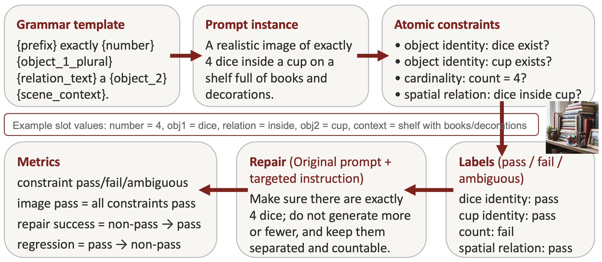
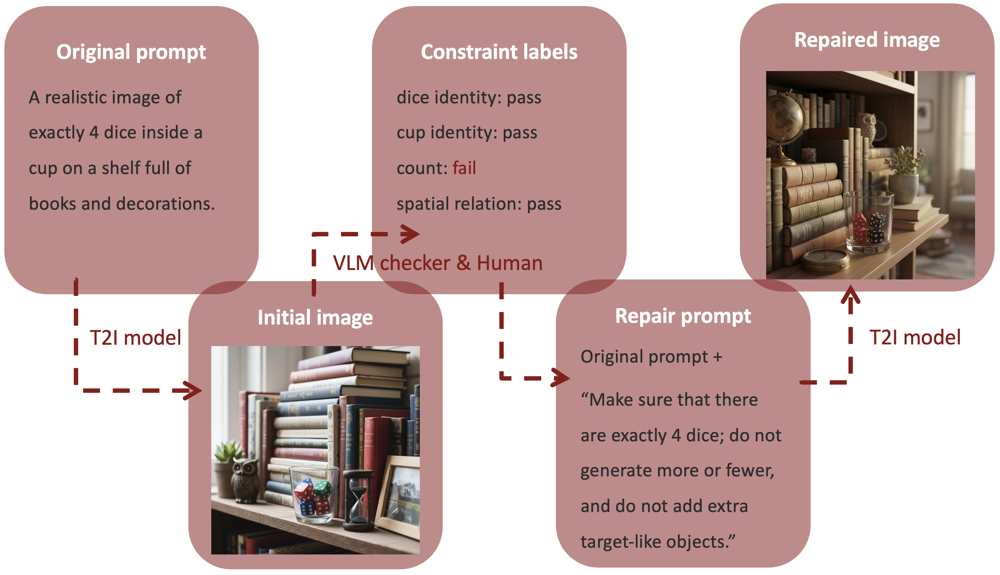
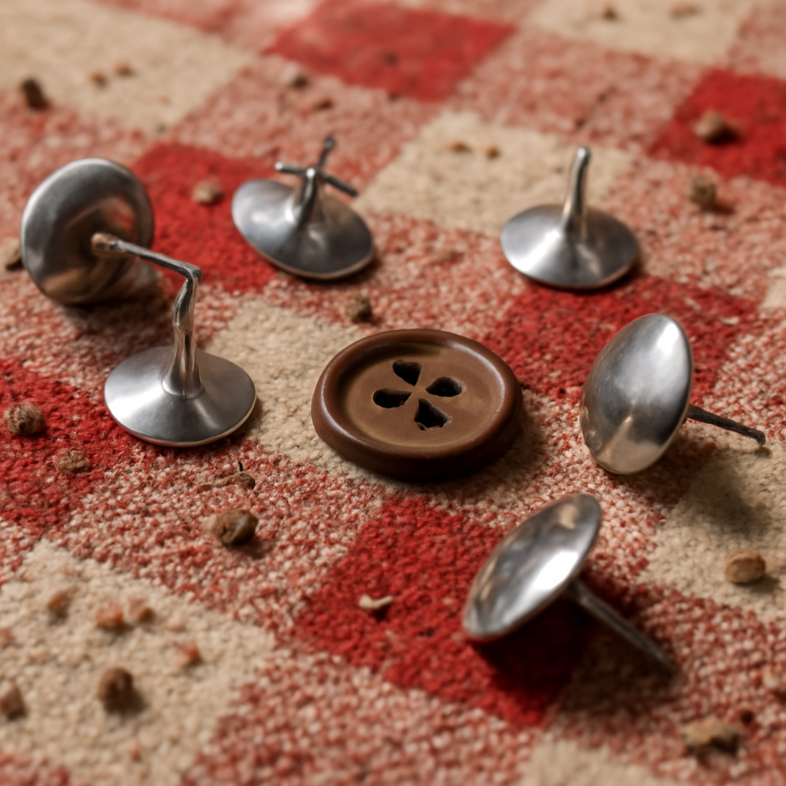

# Constraint-Level Evaluation and Repair for Text-to-Image Prompt Following

CS348K Project Final Report

Yiling Huang

yilhuang@stanford.edu

## Summary

Text-to-image (T2I) models often generate images that look plausible overall while still failing specific parts of a prompt, such as object identity, exact count, object attributes, or spatial relations. This project studies whether decomposing T2I prompts into atomic visual constraints can make these partial prompt-following failures measurable, repairable, and scalable with VLM-assisted checking.

I build an end-to-end workflow that starts from a controlled prompt grammar, generates images with two T2I models, decomposes each prompt into atomic constraints, labels each image-constraint pair with human and VLM checkers, generates targeted repair prompts, and evaluates whether repair improves human-labeled correctness. The main result is that constraint-aware repair improves both image-level and constraint-level pass rates. Human-triggered repair improves image pass rate by 51.9%, while VLM-triggered repair improves image pass rate by 28.0% under human evaluation. These results support the main claim that constraint-level structure is a useful systems abstraction for making partial T2I prompt-following failures measurable and actionable.

## 1. Background and Setup

### 1.1 Partial Prompt-Following Failures

Text-to-image (T2I) models are increasingly good at producing images that look visually plausible at a glance. However, a visually plausible image does not necessarily satisfy all of the requirements in the input prompt. In many cases, the model does not completely ignore the prompt; instead, it satisfies some parts of the prompt while failing others.

For example, consider a prompt such as:

> A realistic image of exactly 4 dice inside a cup on a shelf full of books and decorations.


**Figure 1. Example of a partial prompt-following failure.** The image satisfies the object and spatial requirements, since dice and a cup are visible and the dice are inside the cup. However, it violates the cardinality requirement because the prompt asks for exactly 4 dice while the image contains 5 dice.

This type of partial prompt-following failure is difficult to capture with only image-level evaluation. If I label the entire image as failed, I lose information about which parts of the prompt were actually satisfied. If I only judge whether the image looks realistic, I may miss the prompt-following error entirely. Therefore, this project focuses on evaluating and improving T2I outputs at the level of **individual visual requirements**, not only at the level of the whole image.

### 1.2 Project Goal and Questions

The main goal of this project is to make partial T2I prompt-following failures measurable and repairable. More specifically, I want a system that can identify which parts of a prompt were satisfied, which parts failed, and which parts are uncertain, so that the next generation attempt can be guided toward an image that better satisfies the original prompt.

The **main question** I ask is:

> How can we make partial T2I prompt-following failures measurable and repairable?

There is also a **practical scaling question**. Human judgment is useful for evaluating whether an image satisfies a prompt, but if the goal is to generate and improve many images, manually checking every requirement in every image becomes expensive. Therefore, I also ask:

> Can a VLM checker scale this process by identifying repair targets automatically?

In this framing, the VLM is not meant to replace human judgment. Instead, the goal is to test whether a VLM can provide useful automatic signals for improving generation at scale, while human judgment is still used to evaluate whether the final images actually satisfy the prompt.

### 1.3 Inputs, Outputs, and Success Criteria

The basic task setting is a text-to-image generation problem. The **input** is a text prompt that contains multiple visual requirements, and the **output** is an image that should satisfy as many of those requirements as possible. These requirements may involve object identity, exact count, object attributes, or spatial relations.

A successful system should not only generate an image, but also make the image generation process easier to evaluate and improve. I define success along three dimensions:

- First, the system should **make failures measurable.** Instead of only asking whether the whole image passes or fails, it should expose which specific visual requirements were satisfied, failed, or uncertain.
- Second, the system should **make failures repairable**. If one part of the prompt fails, the system should be able to turn that failure into a targeted repair instruction, rather than rewriting the entire prompt blindly.
- Third, the system should **be reasonably stable and practical**. The same representation should support generation, checking, repair, and analysis. It should also work across different prompt families and T2I models, rather than depending on a single hand-written example.

I do not frame this project as a benchmark competition against an existing repair algorithm. Instead, I evaluate whether a structured representation of prompt requirements is useful enough to support an end-to-end generate-check-repair workflow.

### 1.4 Technical Crux and Conceptual Motivation

The technical crux of this project is deciding how to represent prompt requirements so that they are measurable, repairable, and stable across the full workflow. A requirement that is too vague is difficult for a human to label, difficult for a VLM to check, and difficult to turn into a repair instruction. A requirement that is too rigid may be easy to check, but may not correspond well to natural T2I prompts. The challenge is to define visual requirements at a level that is specific enough to evaluate, but still natural enough to generate useful images.

This project is motivated by a broader theme in generative systems: output quality alone is not enough when the output is supposed to satisfy structured user requirements. SceneEval [1] makes a related observation for text-conditioned 3D indoor scene synthesis, where semantic coherence should be evaluated against explicit user requirements and scene-level expectations rather than only visual realism. My project explores a similar constraint-level idea for 2D text-to-image generation, but extends it into a generate-check-repair workflow.

The project is also influenced by course readings that emphasize structured representations for generation and verification. Grammar-based design systems, such as those discussed in Design for Descent [2], motivated the idea of using a structured design space rather than only free-form natural language prompts. Verification-oriented work such as MoVer [3] also motivated the separation between generation and checking: the system should not only produce an output, but also expose properties that can be checked.

Given this problem setting, I designed a constraint-level grammar as the central abstraction for the project. The grammar is introduced in the next section. It defines controlled prompt families, decomposes prompts into atomic visual constraints, supports human and VLM checking, and converts failed constraints into targeted repair instructions.

## 2. Approach

### 2.1 A Shared Grammar for Generation, Checking, Repair, and Evaluation

The key abstraction in this project is one shared grammar. The grammar does not only generate the original text prompt. It also defines the atomic visual constraints implied by that prompt, and these constraints are then reused for labeling, repair, and evaluation.

This design is important because partial prompt-following failures are only useful if they can be localized. For example, if an image generated from the prompt “exactly 4 dice inside a cup” contains dice and a cup, but generates the wrong number of dice, the system should not only say that the whole image failed. It should be able to identify that the object identity and spatial relation were satisfied, while the cardinality requirement failed.



**Figure 2. Example of the shared grammar.**

The grammar is therefore used as a shared representation across the project:

1. It generates controlled prompts.
2. It decomposes each prompt into atomic constraints.
3. It provides the units that humans and VLMs label.
4. It converts failed or ambiguous constraints into targeted repair instructions.
5. It defines the metrics used to analyze initial generation and repair results.

In other words, the grammar turns a free-form prompt-following problem into a structured generate-check-repair-evaluate problem.

### 2.2 Grammar Design for Controlled Prompt Generation

The grammar is designed to generate prompts with controlled visual requirements. It is not intended to cover every possible user prompt; instead, it creates a manageable testbed where prompt requirements can be systematically generated, labeled, repaired, and analyzed. This controlled setting is important because the project goal is not to maximize prompt diversity, but to study whether partial prompt-following failures can be localized and improved in a stable way.

A prompt is created by filling typed slots such as object category, number, attribute, spatial relation, and scene context. A representative template is:

```text
{prefix} exactly {number} {object_1_plural} {relation_text} a {object_2} {scene_context}.
```

For example, this template can be instantiated as:

```text
A realistic image of exactly 4 dice inside a cup on a shelf full of books and decorations.
```

This example makes the main grammar components easier to see: the template includes a number, a target object, a spatial relation, a reference object, and a scene context. Other prompt families use similar typed slots to generate attribute-only, cardinality-only, spatial-only, and combined prompts.

The main grammar components are summarized below.

| Grammar component | Examples in this project                                     | Purpose                                                      |
| ----------------- | ------------------------------------------------------------ | ------------------------------------------------------------ |
| Prompt family     | single spatial, single attribute, single cardinality, spatial+attribute, spatial+cardinality, attribute+cardinality | Controls which types of visual requirements appear in a prompt |
| Scene context     | simple, natural                                              | Tests whether clutter and context complexity affect prompt-following |
| Object groups     | small items, containers, surfaces                            | Keeps object choices typed and compatible with relations     |
| Attribute groups  | pattern/texture, material/finish                             | Avoids unnatural object-attribute combinations               |
| Spatial relations | left/right, on top of/under, inside/outside                  | Uses relations that are natural and labelable                |
| Numbers           | 3, 4, 5, 6                                                   | Tests exact cardinality control                              |

The full grammar configuration is stored in [grammar_configs.yaml](../../configs/grammar_config.yaml), with additional design notes in [grammar.md](../grammar.md). In the writeup, I focus on the design choices and the resulting evaluation rather than listing every grammar template.

### 2.3 From Prompt Instances to Atomic Constraints

After a prompt is generated, the same grammar instance is used to derive atomic constraints. These constraints are the basic units for checking, repair, and evaluation.

I use four representative constraint types in this project:

| Constraint type  | Meaning                                                      | Example                                           |
| ---------------- | ------------------------------------------------------------ | ------------------------------------------------- |
| object_identity  | Whether the requested object category is clearly present and recognizable | Does the image contain clearly identifiable dice? |
| cardinality      | Whether the requested number of target objects is visible and countable | Does the image contain exactly 4 dice?            |
| attribute        | Whether the requested object has the required pattern, texture, material, or finish | Does the image show a glossy white cup?           |
| spatial_relation | Whether two requested objects satisfy the required relation  | Are the dice inside the cup?                      |

For the example prompt:

```text
A realistic image of exactly 4 dice inside a cup on a shelf full of books and decorations.
```

the grammar produces the following atomic constraints:

| Prompt element  | Atomic constraint type | Constraint                                              |
| --------------- | ---------------------- | ------------------------------------------------------- |
| dice            | object_identity        | The image should contain clearly identifiable dice      |
| cup             | object_identity        | The image should contain a clearly identifiable cup     |
| exactly 4 dice  | cardinality            | The image should contain exactly 4 clearly visible dice |
| dice inside cup | spatial_relation       | The dice should be inside the cup                       |

Attribute constraints are generated in the same way when the prompt includes material, finish, pattern, or texture requirements. For example, a prompt containing “a glossy white cup” produces an attribute constraint checking whether the cup has the requested glossy white material or surface finish.

This decomposition is what makes the problem measurable. Instead of assigning one label to the entire image, the system can ask which specific requirements were satisfied and which were not.

### 2.4 Label Design and Human/VLM Checking

Each atomic constraint receives one of three labels:

| Label     | Meaning                                                  |
| --------- | -------------------------------------------------------- |
| pass      | The constraint is reasonably satisfied                   |
| fail      | The constraint is clearly violated                       |
| ambiguous | The constraint is uncertain or not confidently judgeable |

The ambiguous label is important for generated images. In this project, ambiguity does not only mean that the image is blurry or occluded. It also includes cases where the model generates an object-like shape that looks plausible, but whose identity cannot be confidently determined.

For example, the prompt below asks for thumbtacks:

```text
A realistic image of exactly 4 thumbtacks outside a food container on a picnic blanket with many small objects.
```


**Figure 3. Example of an ambiguous object-identity case.** The image contains four red object-like shapes in the expected location, but it is difficult to confidently identify them as thumbtacks. I label this kind of case as ambiguous rather than forcing a pass/fail decision.

Human labels are used as the ground-truth evaluation signal. A VLM checker is used to test whether the checking process can be automated at scale. Both humans and the VLM judge the same image-constraint pairs, which makes it possible to compare their agreement. However, VLM labels are not treated as final truth; they are used as automatic signals that can guide the next generation attempt.

### 2.5 Constraint-Aware Repair Prompt Generation

The repair stage uses the same constraint representation. When a constraint is labeled as fail or ambiguous, the system converts that constraint into a targeted repair instruction.

The repaired prompt is constructed by keeping the original prompt and appending repair instructions for the failed or ambiguous constraints. For example, if the cardinality constraint fails for the dice prompt, the repair prompt keeps the original description and adds an instruction such as:

```text
Make sure there are exactly 4 dice; do not generate more or fewer, and keep them separated and countable.
```

This design avoids rewriting the entire prompt from scratch. Instead, the grammar identifies which part of the prompt failed and produces an instruction that directly targets that requirement.

The repair instruction is generated according to the failed or ambiguous constraint type:

| Constraint type  | Repair focus                                                 | Example repair instruction                                   |
| ---------------- | ------------------------------------------------------------ | ------------------------------------------------------------ |
| object_identity  | Make the requested object recognizable and avoid replacing it with a different category | Make sure the image clearly contains identifiable dice.      |
| cardinality      | Enforce the exact count and keep target objects separated and countable | Make sure there are exactly 4 dice; do not generate more or fewer, and keep them separated and countable. |
| attribute        | Apply the requested pattern, texture, material, or finish to the correct object | Make sure the cup has the glossy white material or surface finish. |
| spatial_relation | Make the requested relation visually clear                   | Make sure the dice are clearly inside the cup.               |

For constraints labeled as `ambiguous`, the repair instruction is phrased to make the requirement clear and easy to judge, rather than only asking the model to correct a clear failure. This is useful because ambiguous cases are not always clearly wrong; sometimes the generated image simply does not provide enough visual evidence.

Overall, the repair approach follows the same grammar-level principle as the rest of the system: the unit of repair is not the entire image, but the specific visual requirement that failed or was uncertain.

## 3. Evaluation and Results

This section evaluates whether the proposed constraint-level workflow makes partial T2I prompt-following failures measurable, whether a VLM checker can provide useful automatic repair signals, and whether constraint-aware repair improves human-labeled correctness.

### 3.1 Experimental Workflow, Setup, and Metrics

The experiment follows the full generate-check-repair-evaluate workflow shown below.



**Figure 4. Experimental workflow.**

The workflow starts by instantiating a grammar-generated prompt and deriving its atomic constraints. The prompt is sent to a T2I model to generate an initial image. Each image-constraint pair is then checked by a human annotator and by a VLM checker. Human labels are used as the ground-truth evaluation signal. VLM labels are used to test whether the process can be scaled by automatically identifying repair targets.

For repair, the system keeps the original prompt and appends targeted instructions for constraints labeled as fail or ambiguous. The repaired image is then evaluated again using human labels. This allows the experiment to measure not only whether repair improves the whole image, but also which individual constraints were fixed or regressed.

The final experiment uses the following setup.

| Component                    | Setting                                                      |
| ---------------------------- | ------------------------------------------------------------ |
| Number of prompts            | 180                                                          |
| Number of atomic constraints | 720                                                          |
| Prompt families              | single spatial, single attribute, single cardinality, spatial+attribute, spatial+cardinality, attribute+cardinality |
| Scene context types          | simple, natural                                              |
| T2I models                   | OpenAI gpt-image-1 [4], Google gemini-2.5-flash-image [5, 6] |
| VLM checker                  | GPT-4.1 [7]                                                  |
| Labels                       | pass, fail, ambiguous                                        |
| Repair settings              | human-triggered, VLM-triggered, combined                     |

I use three groups of metrics.

**Initial generation metrics.** I measure image pass rate, constraint pass rate, fail/ambiguous distributions, and breakdowns by prompt family, constraint type, T2I model, and scene context. An image passes only when all of its atomic constraints pass.

**VLM agreement metrics.** I compare VLM labels with human labels using agreement, non-pass recall, and non-pass precision. Here, non-pass means either fail or ambiguous. Non-pass recall measures how many human-labeled non-pass cases the VLM catches. Non-pass precision measures how many VLM-flagged non-pass cases are also non-pass under human labels.

**Repair metrics.** I compare labels before and after repair. Important metrics include before/after pass rate, pass rate delta, nonpass-to-pass rate, pass-to-nonpass rate, and regression rate. I also break repair results down by constraint type, prompt family, model, and scene context.

### 3.2 Initial Generation Results

The initial generation results show why whole-image evaluation is not enough. Under human labels, only **55.0%** of images pass all constraints, while **85.8%** of individual constraints pass.

| Level      | Number | Human pass | Human fail | Human ambiguous |
| ---------- | :----- | :--------- | :--------- | :-------------- |
| Image      | 180    | 55.0%      | 33.3%      | 11.7%           |
| Constraint | 720    | 85.8%      | 9.4%       | 4.7%            |

This gap is the main evidence that whole-image evaluation hides useful structure. Many generated images are not simply “correct” or “incorrect”; they contain a mix of satisfied and failed requirements. By decomposing prompts into atomic constraints, the system can localize which part of a prompt failed and preserve the information needed for targeted repair.

#### Results by Prompt Family

The image-level pass rate drops when prompts combine multiple requirement types.

| Prompt family                  | Images | Human pass | Human fail | Human ambiguous |
| ------------------------------ | ------ | ---------- | ---------- | --------------- |
| single spatial                 | 24     | 70.8%      | 20.8%      | 8.3%            |
| single attribute               | 24     | 70.8%      | 8.3%       | 20.8%           |
| single cardinality             | 24     | 66.7%      | 33.3%      | 0.0%            |
| combined spatial attribute     | 36     | 52.8%      | 30.6%      | 16.7%           |
| combined spatial cardinality   | 36     | 47.2%      | 38.9%      | 13.9%           |
| combined attribute cardinality | 36     | 36.1%      | 55.6%      | 8.3%            |

Single-constraint prompt families reach roughly **67–71%** image pass rate, while combined prompt families drop to roughly **36–53%**. This supports the partial-failure framing: as the prompt combines more requirements, the probability that at least one requirement fails increases. This is also why constraint-level evaluation is useful; it identifies which part of a combined prompt caused the image-level failure.

#### Results by Constraint Type

The constraint-level results show that different requirement types have very different difficulty.

| Constraint type  | Constraints | Human pass | Human fail | Human ambiguous |
| ---------------- | ----------- | ---------- | ---------- | --------------- |
| object_identity  | 336         | 87.8%      | 5.4%       | 6.9%            |
| cardinality      | 96          | 58.3%      | 38.5%      | 3.1%            |
| attribute        | 192         | 94.3%      | 2.6%       | 3.1%            |
| spatial_relation | 96          | 89.6%      | 8.3%       | 2.1%            |


Cardinality is the hardest constraint type in the initial generation stage. Attribute constraints have the highest human pass rate (**94.3%**), followed by spatial relation (**89.6%**) and object identity (**87.8%**). Cardinality is much lower at **58.3%**. This suggests that exact counting remains difficult for these T2I models, even when the grammar restricts counts to 3–6.

The spatial relation pass rate is relatively high in the final dataset. This also reflects a grammar design iteration: earlier versions of the project used image-plane relations such as “higher” and “lower,” which were difficult to interpret consistently. The final grammar uses more natural relations such as `inside`, `outside`, `on top of`, and `under`, which are easier for humans and VLMs to judge.

#### Results by Model

The two T2I models have different absolute performance, but both show the same pattern of partial failures.

| T2I model              | Images | Human pass | Human fail | Human ambiguous |
| ---------------------- | ------ | ---------- | ---------- | --------------- |
| gemini-2.5-flash-image | 90     | 43.3%      | 45.6%      | 11.1%           |
| gpt-image-1            | 90     | 66.7%      | 21.1%      | 12.2%           |

gpt-image-1 achieves a higher human image pass rate (**66.7%**) than gemini-2.5-flash-image (**43.3%**). However, both models still show a large gap between image-level and constraint-level pass rates. For gpt-image-1, image pass is **66.7%** while constraint pass is **89.7%**. For Gemini, image pass is 43.3% while constraint pass is **81.9%**.

This suggests that partial prompt-following failures are not specific to one generator. The constraint-level grammar provides a common evaluation structure across both models, even though the models differ in absolute performance.

#### Results by Scene Context

Scene context also affects initial generation, but the effect is smaller than the differences between prompt families or constraint types.

| Scene context | Images | Human pass | Human fail | Human ambiguous |
| ------------- | ------ | ---------- | ---------- | --------------- |
| natural       | 118    | 51.7%      | 38.1%      | 10.2%           |
| simple        | 62     | 61.3%      | 24.2%      | 14.5%           |


Simple scenes have a higher image pass rate (**61.3%**) than natural scenes (**51.7%**). This is expected because natural scenes include more clutter and unrelated objects, which can make object identity, counting, and spatial relations harder to judge. However, the difference is not as large as the gap between single and combined prompt families, or the gap between cardinality and other constraint types.

### 3.3 VLM-Human Agreement

The VLM checker is intended to make the workflow more scalable by identifying possible repair targets automatically. To evaluate whether this is reasonable, I compare VLM labels against human labels.

| Level            | N    | Agreement | Non-pass precision | Non-pass recall | Non-pass F1 |
| ---------------- | ---- | --------- | ------------------ | --------------- | ----------- |
| Image-level      | 180  | 69.4%     | 72.0%              | 82.7%           | 77.0%       |
| Constraint-level | 720  | 80.4%     | 42.9%              | 71.6%           | 53.7%       |

At the image level, the VLM has **69.4%** exact agreement with human labels and **82.7%** non-pass recall. At the constraint level, it has **80.4%** exact agreement and **71.6%** non-pass recall. This means the VLM catches many human-labeled non-pass cases, which is useful for repair triggering.

The lower constraint-level non-pass precision (**42.9%**) shows that the VLM also over-flags some constraints. In other words, it sometimes marks constraints as fail or ambiguous when human labels consider them pass. However, this behavior is still useful for my use case. The VLM does not need to replace human judgment; it needs to provide useful automatic signals for identifying possible repair targets. Therefore, I use the VLM as an automatic repair trigger, while human labels remain the final evaluation signal for whether repair actually improves the image.

Agreement also varies by constraint type.

| Constraint type  | N    | Agreement | Non-pass precision | Non-pass recall | Non-pass F1 |
| ---------------- | ---- | --------- | ------------------ | --------------- | ----------- |
| object_identity  | 336  | 82.1%     | 42.9%              | 65.8%           | 51.9%       |
| cardinality      | 96   | 75.0%     | 68.1%              | 80.0%           | 73.6%       |
| attribute        | 192  | 81.2%     | 19.4%              | 63.6%           | 29.8%       |
| spatial_relation | 96   | 78.1%     | 29.2%              | 70.0%           | 41.2%       |


The VLM has the strongest non-pass precision and recall on cardinality, which is reasonable because count errors are often visually explicit. Attribute and spatial relation have lower non-pass precision, suggesting that the VLM sometimes applies a stricter standard than the human annotator or over-interprets visual uncertainty. This explains why VLM-triggered repair is useful but noisier than human-triggered repair.

| Case                   | Prompt & Image                                               | Constraint                                                   | Human label | VLM label | Interpretation                               |
| ---------------------- | ------------------------------------------------------------ | ------------------------------------------------------------ | ----------- | --------- | -------------------------------------------- |
| Useful detection       | A realistic image of exactly **4 dice** inside a cup on a shelf full of books and decorations. | **Cardinality:** Does the image contain exactly 4 clearly visible dice? | fail        | fail      | VLM catches a useful repair target           |
| False positive trigger | A realistic image of exactly 3 matte black dice and one **yellow-and-green polka-dotted** index card on a shelf full of books and decorations. | **Attribute:** Does the image show a yellow-and-green polka-dotted index card? | pass        | fail      | VLM may trigger unnecessary repair           |
| Missed repair target   | A realistic image of exactly **5 reflective metallic thumbtacks** and one plastic standard sewing button on a picnic blanket with many small objects. | **Cardinality:** Does the image contain exactly 5 clearly visible thumbtacks? | fail        | pass      | VLM misses a failure that should be repaired |

**Table 1. Examples of VLM-human agreement and disagreement.** The VLM is useful because it catches many human-labeled non-pass cases, but it can also over-flag constraints that humans consider pass, or miss a failure that should be repaired. This is why VLM labels are used as automatic repair triggers rather than final ground truth.

### 3.4 Repair results

The repair experiment evaluates the central hypothesis of this project: constraint-level structure should make T2I prompt-following failures actionable, not just measurable. If failed or ambiguous constraints can be converted into targeted repair instructions, then the repaired images should have higher human-labeled pass rates than the initial images.

I report three repair settings:

- **Human-triggered repair:** repair targets come from human labels. This is the oracle setting.
- **VLM-triggered repair:** repair targets come from VLM labels. This is the practical automatic setting.
- **Combined repair:** all repair attempts from both trigger sources are summarized together.

#### **Overall Repair Results**

| Trigger source  | Repair attempts | Target constraints | Image pass Δ | Constraint pass Δ | Image fixed | Regression |
| --------------- | --------------- | ------------------ | ------------ | ----------------- | ----------- | ---------- |
| Human-triggered | 81              | 102                | 51.8 pts     | 16.7 pts          | 51.8%       | 11.1%      |
| VLM-triggered   | 93              | 170                | 28.0 pts     | 9.7 pts           | 34.4%       | 15.0%      |
| Combined        | 174             | 272                | 39.1 pts     | 12.9 pts          | 42.5%       | 13.2%      |

The result is positive across all three repair settings. Human-triggered repair, VLM-triggered repair, and combined repair all improve both image-level and constraint-level pass rates under human evaluation. This is the strongest evidence that the constraint-level repair idea works: the same grammar that decomposes prompts into checkable constraints can also turn failed constraints into useful repair instructions.

Human-triggered repair provides the clearest test of the repair mechanism because the repair targets come from human labels. In this oracle setting, image pass rate improves by **51.9 percentage points**, and constraint pass rate improves by **16.7 points**. This shows that when the failed constraints are correctly identified, grammar-based repair instructions can substantially improve generated images.

VLM-triggered repair is the practical setting, where repair targets are selected automatically. Even with noisier VLM targets, image pass rate still improves by **28.0 points**, and constraint pass rate improves by **9.7 points** under human evaluation. This suggests that the approach is not only useful with human-provided repair targets, but also has practical value when repair targets are identified automatically.

At the same time, repair is not risk-free. The VLM-triggered setting has a higher regression rate (**15.1%**) than the human-triggered setting (**11.1%**), which is consistent with VLM trigger noise. This is why I track regression separately: a useful repair system should not only fix failed constraints, but also avoid breaking constraints that were already correct.

#### Before/after pass rates

| Trigger source  | Before image pass | After image pass | Before constraint pass | After constraint pass | Target fixed |
| --------------- | ----------------- | ---------------- | ---------------------- | --------------------- | ------------ |
| Human-triggered | 0.0%              | 51.8%            | 70.1%                  | 86.8%                 | 64.7%        |
| VLM-triggered   | 28.0%             | 55.9%            | 78.5%                  | 88.3%                 | 80.0%        |
| Combined        | 14.9%             | 54.0%            | 74.7%                  | 87.6%                 | 74.3%        |

This table shows the same result from a before/after perspective. Human-triggered repair starts from images that humans labeled as non-pass, so the before image pass rate is **0.0%**. After repair, **51.9%** of these images pass all constraints.

In the VLM-triggered setting, some repair attempts were triggered by VLM false positives, so the human before image pass rate is already **28.0%**. Even so, the after image pass rate increases to **55.9%**. This is important because it shows that VLM-triggered repair is not merely repairing oracle-selected failures; it still improves human-evaluated correctness under a more practical automatic trigger setting.

At the constraint level, all three settings also improve. The combined repair setting increases constraint pass rate from **74.7%** to **87.6%**, which means the repair process improves individual visual requirements even when not every entire image becomes fully correct.

#### Repair by constraint type

The combined repair results show that repair success differs strongly by constraint type.

| Constraint type  | N    | Before pass | After pass | Pass Δ   | Non-pass→pass | Pass→non-pass |
| ---------------- | ---- | ----------- | ---------- | -------- | ------------- | ------------- |
| object_identity  | 332  | 78.0%       | 91.0%      | 13.0 pts | 71.2%         | 3.5%          |
| cardinality      | 107  | 29.0%       | 52.3%      | 23.4 pts | 44.7%         | 29.0%         |
| attribute        | 214  | 90.6%       | 97.7%      | 7.0 pts  | 95.0%         | 2.1%          |
| spatial_relation | 89   | 78.6%       | 93.3%      | 14.6 pts | 79.0%         | 2.9%          |

Attribute constraints repair very well, with a **95.0%** nonpass-to-pass rate. Spatial relation and object identity constraints also improve substantially. Cardinality remains the hardest constraint type: although its pass rate improves by **23.4 points**, its nonpass-to-pass rate is only **44.7%**, and its regression rate is much higher than the other types.

This result is consistent with the initial generation analysis. Exact counting is not only hard during initial generation; it also remains difficult to repair reliably. Constraint-level analysis makes this visible. If I only reported overall image pass rate, this difference between constraint types would be much harder to see.

#### **Qualitative Repair Examples**

Table 2 shows representative qualitative repair outcomes. 

| Case                          | Prompt                                                       | Before                                                       | After                                                        |
| ----------------------------- | ------------------------------------------------------------ | ------------------------------------------------------------ | ------------------------------------------------------------ |
| Successful repair             | A realistic image of exactly **4 dice** inside a cup on a shelf full of books and decorations. | **Ground truth: fail**<br />4 dice - Human fail | **Ground truth: pass**<br />4 dice - Human pass |
| VLM false-positive regression | A realistic image of exactly **3 matte black dice** and one **yellow-and-green polka-dotted** index card on a shelf full of books and decorations. | **Ground truth: pass**<br />3 dice - Human pass, VLM pass;<br />yellow-and-green polka-dotted - Human pass, VLM **fail** | **Ground truth: fail**<br />3 dice - Human **fail**;<br />yellow-and-green polka-dotted - Human pass |
| Target fixed, count regressed | A realistic image of exactly **5 standard safety pins** to the **left** of a napkin on a shelf full of books and decorations. | **Ground truth: fail**<br />5 pins - Human pass;<br />to the left - Human **fail** | **Ground truth: fail**<br />5 pins - Human **fail**;<br />to the left - Human pass |

**Table 2. Qualitative examples of repair outcomes.** Constraint-aware repair can fix targeted failures, but it can also introduce regressions. The examples show one successful repair, one VLM false-positive repair that creates a new count error, and one tradeoff case where the target spatial relation is fixed but cardinality regresses.

The first example illustrates the intended behavior of the system: a failed count constraint is converted into a targeted repair instruction, and the repaired image satisfies the count. The second example shows why VLM-triggered repair can regress. The original image is human-labeled as pass, but because the VLM flags the index-card attribute as non-pass, the repair attempt changes the image and introduces a new count failure. The third example shows that even human-triggered repair can involve tradeoffs: the repair fixes the target spatial relation, but breaks the previously correct cardinality constraint.

These examples show that constraint-aware repair is useful, but not risk-free. The same targeted instruction that improves one requirement can shift the generation enough to affect other constraints, especially exact cardinality. This is why the evaluation reports both repair success and regression.

#### Additional Repair Breakdowns

I also analyzed repair results by prompt family, T2I model, and scene context. These breakdowns are included in the appendix A. In brief, repair improves both T2I models and both scene context types, while prompt families involving cardinality remain harder to repair. This is consistent with the constraint-type analysis above.

## 4. Discussion and Takeaways

The results support the central claim that constraint-level structure is a useful systems abstraction for T2I prompt following. The grammar makes partial failures measurable, turns failed constraints into targeted repair instructions, and supports before/after evaluation. The main contribution is not a single best prompt-repair heuristic, but a stable generate-check-repair-evaluate workflow built around visual constraints.

The results also show that prompt-following difficulty is not uniform. Combined prompts are harder than single-constraint prompts, and cardinality is much harder than attribute or spatial relation constraints. This is exactly the kind of diagnosis that image-level evaluation alone would hide. Constraint-level analysis is useful because it shows not only whether repair works, but where it works and where it still struggles.

VLM checking is promising as a scalable repair trigger, but it is not reliable enough to replace human evaluation. The VLM catches many human-labeled non-pass cases, but it also over-flags constraints, especially at the constraint level. This explains why VLM-triggered repair improves correctness but has a higher regression rate than human-triggered repair.

These results suggest two natural extensions. First, physical plausibility and relative object scale could be added as explicit constraints, since pilot generations sometimes produced correct objects with unrealistic relative sizes. Second, the VLM checker could be calibrated more carefully so that it still catches useful repair targets while reducing unnecessary false-positive repairs.

Overall, the main takeaway is that constraint-level structure is useful not only because it improves one overall score, but because it makes failures actionable and analyzable. It tells us what failed, what repair helped, and which parts of T2I prompt following remain difficult.

## 5. Team Responsibilities

This was an individual project. I designed the constraint grammar, implemented the prompt generation, T2I image generation, VLM checking, repair prompt generation, labeling template generation, and result analysis pipeline. I also generated the dataset, performed the human annotation, analyzed the results, prepared the final presentation, and wrote the final report.

## 6. References

1. Hou In Ivan Tam, Hou In Derek Pun, Austin T. Wang, Angel X. Chang, and Manolis Savva. **SceneEval: Evaluating Semantic Coherence in Text-Conditioned 3D Indoor Scene Synthesis.** arXiv:2503.14756, 2025. https://arxiv.org/abs/2503.14756
2. Milin Kodnongbua, Zihan Jack Zhang, Nicholas Sharp, and Adriana Schulz. **Design for Descent: What Makes a Shape Grammar Easy to Optimize?** SIGGRAPH Asia Conference Papers, 2025. https://www.computationaldesign.group/publications/design-for-descent
3. Jiaju Ma and Maneesh Agrawala. **MoVer: Motion Verification for Motion Graphics Animations.** arXiv:2502.13372, 2025. https://arxiv.org/abs/2502.13372
4. OpenAI. **Image generation guide.** OpenAI API documentation. https://developers.openai.com/api/docs/guides/image-generation
5. Google. **Gemini API documentation.** Google AI for Developers. https://ai.google.dev/gemini-api/docs
6. Google Developers Blog. **Introducing Gemini 2.5 Flash Image.** https://developers.googleblog.com/en/introducing-gemini-2-5-flash-image/
7. OpenAI. **GPT-4.1 model documentation.** OpenAI API documentation. https://developers.openai.com/api/docs/models/gpt-4.1

## Appendix A. Additional Repair Breakdowns

The main repair section reports the overall repair results and the breakdown by constraint type. This appendix includes additional breakdowns by prompt family, T2I model, and scene context. These results are not the central evidence for the project, but they help show how the repair behavior varies across different experimental conditions.

### A.1 Repair by Prompt Family

The table below reports combined repair results by prompt family. Each row compares human labels before and after repair for all repair attempts in that prompt family.

| Prompt family                  | Before image pass | After image pass | Image pass Δ | Image fixed rate | Regression rate |
| :----------------------------- | :---------------- | :--------------- | :----------- | :--------------- | :-------------- |
| single_attribute               | 17.6%             | 52.9%            | +35.3 pts    | 41.2%            | 5.9%            |
| single_cardinality             | 11.8%             | 47.1%            | +35.3 pts    | 35.3%            | 0.0%            |
| single_spatial                 | 16.7%             | 66.7%            | +50.0 pts    | 58.3%            | 8.3%            |
| combined_attribute_cardinality | 17.0%             | 44.7%            | +27.7 pts    | 36.2%            | 8.5%            |
| combined_spatial_attribute     | 20.0%             | 68.6%            | +48.6 pts    | 51.4%            | 2.9%            |
| combined_spatial_cardinality   | 7.5%              | 42.5%            | +35.0 pts    | 35.0%            | 0.0%            |

Repair improves image-level pass rate for every prompt family. The largest improvements appear in single_spatial and combined_spatial_attribute, while prompt families involving cardinality remain harder. This matches the constraint-type analysis in the main text: cardinality is difficult both during initial generation and during repair.

At the same time, combined prompt families still show substantial improvement after repair. This supports the main idea that constraint-level repair is useful specifically because combined prompts often fail only in one or two localized requirements. The repair process can target those failed requirements rather than rewriting the whole prompt blindly.

### A.2 Repair by T2I Model

The table below reports combined repair results by the original T2I model used to generate the source image.

| T2I model              | Before image pass | After image pass | Image pass Δ | Constraint before pass | Constraint after pass | Constraint pass Δ |
| :--------------------- | :---------------- | :--------------- | :----------- | :--------------------- | :-------------------- | :---------------- |
| gpt-image-1            | 20.7%             | 62.1%            | +41.4 pts    | 78.5%                  | 87.6%                 | +9.1 pts          |
| gemini-2.5-flash-image | 9.2%              | 46.0%            | +36.8 pts    | 72.0%                  | 88.1%                 | +16.2 pts         |

Repair improves both T2I models. The absolute before/after numbers differ because the two generators have different initial behavior, but both show positive image-level and constraint-level pass-rate changes. This supports the interpretation that the constraint-level repair workflow is not tied to a single generator.

The two models also show different repair profiles. gpt-image-1 starts with a higher before-repair image pass rate and ends with a higher after-repair image pass rate. Gemini starts lower, but shows a larger constraint-level pass-rate gain. I do not interpret this as a benchmark comparison between the two image models; instead, the result shows that the same grammar and repair analysis can be applied across different generators.

### A.3 Repair by Scene Context

The table below reports combined repair results by scene context.

| Scene context | Before image pass | After image pass | Image pass Δ | Constraint before pass | Constraint after pass | Constraint pass Δ |
| :------------ | :---------------- | :--------------- | :----------- | :--------------------- | :-------------------- | :---------------- |
| simple        | 17.6%             | 56.9%            | +39.2 pts    | 76.5%                  | 89.2%                 | +12.7 pts         |
| natural       | 13.0%             | 52.0%            | +39.0 pts    | 73.9%                  | 86.5%                 | +12.6 pts         |

Initial generation performs slightly better in simple scenes than in natural scenes, as discussed in the main results. However, repair improvement is very similar across the two scene context types. Image pass rate improves by about 39 percentage points in both simple and natural contexts, and constraint pass rate improves by about 12–13 points in both settings.

This suggests that scene context affects the initial difficulty of generation, but in this dataset it is not the main factor determining repair improvement. Prompt family and constraint type appear to be stronger predictors of difficulty than whether the scene is simple or natural.

### A.4 Summary of Additional Breakdowns

Across prompt families, T2I models, and scene contexts, the additional breakdowns are consistent with the main repair results:

1. Repair improves image-level and constraint-level pass rates across multiple experimental conditions.
2. Prompt families involving cardinality remain harder to repair.
3. Both T2I models benefit from constraint-aware repair, though their absolute performance differs.
4. Simple and natural scene contexts show similar repair gains, even though simple scenes start with slightly better initial generation results.

These additional results support the main conclusion that constraint-level structure provides a useful and general way to localize prompt-following failures and turn them into actionable repair signals.
